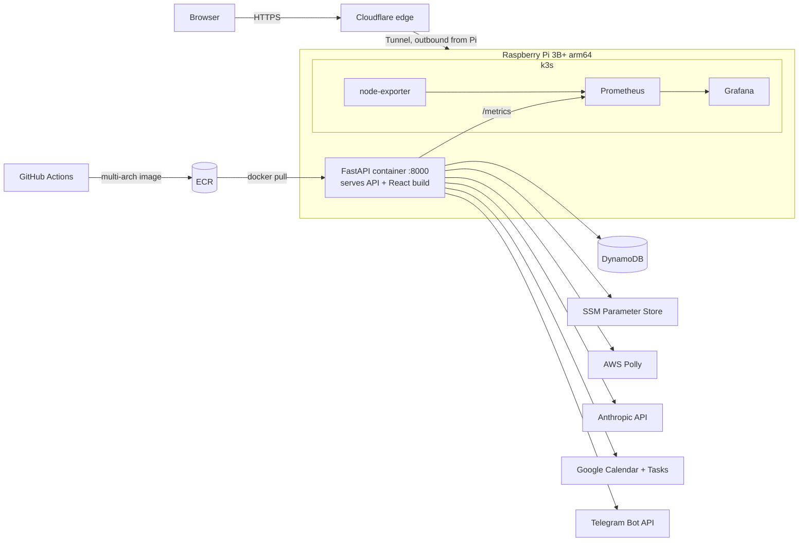

# MakeMyDays: Architecture Cheatsheet

Quick reference for how the system fits together. Placeholders like `<account-id>` stand in for real values; look those up in AWS or your password manager, never commit them.

---

## 1. Big picture



**One-sentence version:** a single FastAPI container on the Pi serves both the JSON API and the built React SPA; state lives in DynamoDB, secrets in SSM, and Cloudflare Tunnel exposes it to the internet without opening any router ports.

---

## 2. Request lifecycle

1. Browser hits the public domain, Cloudflare terminates TLS.
2. `cloudflared` on the Pi holds an **outbound** connection to Cloudflare, so traffic comes back through it. No port forwarding, no static IP.
3. Request reaches uvicorn on port `8000`.
4. FastAPI matches routes **in registration order**:
   - `/metrics` (Prometheus instrumentator)
   - `/api/auth/*`, `/api/events`, `/api/tasks`, `/api/briefing*`, `/api/habits*`, `/api/shopping*`
   - `/assets/*` (static JS/CSS from `frontend/dist`)
   - `/health`
   - `/{full_path:path}` catch-all returns `index.html`, React Router takes over
5. Protected routes run `Depends(get_current_user)` first (see section 5).

> Rule: the SPA catch-all must stay the **last** route in `main.py`. Anything registered after it is unreachable.

---

## 3. Repo layout

```
app/
  main.py              # app object, router wiring, static files, SPA fallback
  config.py            # ENV=production -> SSM, otherwise -> .env
  auth/                # signup/login/session cookie
    router.py          #   HTTP layer (Pydantic models, status codes)
    service.py         #   DynamoDB access
    security.py        #   PBKDF2 hashing, signed session tokens
    dependencies.py    #   get_current_user, set_session_cookie
  briefing/            # calendar, tasks, Claude briefing, Polly audio
  habits/              # habit CRUD + streak logic
  shopping/            # shopping list CRUD
  notifications/       # Telegram sender
frontend/              # React 18 + Vite + Tailwind + React Router
  src/api.js           #   every backend call goes through here
  src/auth/            #   AuthContext, RequireAuth guard
  src/pages/           #   one file per page
  dist/                #   build output served by FastAPI
tests/                 # pytest, run in CI before build
infra/                 # Terraform (legacy EC2 setup, see section 9)
k8s/                   # manifests from the k3s phase
.github/workflows/     # deploy.yml
```

### Backend layering (per feature)

| Layer | File | Responsibility | Knows about |
|---|---|---|---|
| Router | `router.py` | HTTP: paths, Pydantic bodies, status codes, `HTTPException` | service, auth dependency |
| Service | `service.py` | Business logic + DynamoDB calls | boto3, nothing HTTP |
| Model | Pydantic classes in router | Request validation | nothing |

Services raise `ValueError`, routers translate that into `404` / `409` / `401`. Keep HTTP concerns out of services.

**Adding a feature:** create `app/<feature>/{__init__,router,service}.py` → `include_router` in `main.py` **above** the catch-all → add methods to `frontend/src/api.js` → add page + route in `App.jsx` and `nav.js` → add tests.

---

## 4. API surface

| Method | Path | Auth | Notes |
|---|---|---|---|
| GET | `/health` | no | liveness check |
| GET | `/metrics` | no | Prometheus scrape target |
| POST | `/api/auth/signup` | no | sets session cookie, `201` |
| POST | `/api/auth/login` | no | sets session cookie |
| POST | `/api/auth/logout` | no | deletes cookie, `204` |
| GET / PATCH | `/api/auth/me` | yes | current user / update name + avatar |
| GET | `/api/events` | no | today's Google Calendar events |
| GET | `/api/tasks` | no | open Google Tasks across all lists |
| GET | `/api/briefing` | no | Claude briefing (currently placeholder) |
| GET | `/api/briefing/audio` | no | MP3 via Polly, streamed |
| GET / POST | `/api/habits` | yes | list / create |
| POST | `/api/habits/{id}/toggle` | yes | body `{date: "YYYY-MM-DD"}` |
| DELETE | `/api/habits/{id}` | yes | `204` |
| GET / POST | `/api/shopping` | yes | list / create |
| POST | `/api/shopping/{id}/toggle` | yes | flips `purchased` |
| DELETE | `/api/shopping/{id}` | yes | `204` |

Interactive docs while running locally: `http://localhost:8000/docs`.

Frontend pages without a backend yet: **Budget, Shared Costs, Notes**.

---

## 5. Authentication

Hand-rolled, no external auth library.

```
login -> verify PBKDF2 hash -> create token -> Set-Cookie: session=<token>
                                                (HttpOnly, SameSite=Lax, Secure in prod)
next request -> read cookie -> verify HMAC signature -> check exp
             -> load user from DynamoDB -> re-issue cookie (sliding expiry)
```

| Piece | How |
|---|---|
| Password storage | PBKDF2-HMAC-SHA256, 260k iterations, random 16-byte salt, stored as base64(salt + digest) |
| Session token | `base64url(json payload).hmac_sha256_hex` (JWT-like, but not a JWT) |
| Token payload | `user_id`, `email`, `exp` |
| Idle timeout | 30 min (`SESSION_IDLE_TIMEOUT_SECONDS`), slid forward on every authenticated request |
| Browser close | cookie has no `max_age`, so it's a session cookie and disappears |
| Frontend mirror | `AuthContext.jsx` has its own 30 min idle timer; keep both values in sync |
| Constant-time compare | `hmac.compare_digest` for hashes and signatures (prevents timing attacks) |

> The token is **signed, not encrypted**. Anyone holding it can read the payload; they just can't change it. Same idea as k8s Secrets being base64 rather than encrypted.

> `SESSION_SECRET` must be set in production. If it's missing, the code falls back to a dev default and anyone could forge sessions.

---

## 6. Data (DynamoDB)

| Table | Partition key | Other attributes | Access pattern |
|---|---|---|---|
| `makemydays-users` | `email` | `user_id`, `name`, `password_hash`, `avatar_url`, `created_at` | `get_item` by email |
| `makemydays-habits` | `habit_id` | `user_id`, `name`, `emoji`, `goal_streak`, `completions` (string set) | `scan` filtered by `user_id` |
| `makemydays-shopping` | `item_id` | `user_id`, `name`, `description`, `url`, `price_min/max`, `purchased` | `scan` filtered by `user_id` |

DynamoDB gotchas already hit in this codebase:

- **Empty sets are not allowed.** Omit `completions` on create; use `ADD` / `DELETE` update expressions to change the set.
- **No Python floats.** Convert with `Decimal(str(value))` on write and `float()` on read.
- **`scan` + `FilterExpression` reads the whole table** and filters afterwards. Fine at personal scale, but you pay for every item. The scalable fix is a GSI on `user_id` and `query`.
- **Ownership check:** every get/toggle/delete compares `item["user_id"]` to the logged-in user before acting. Keep doing this; the key alone isn't authorization.
- boto3 resource is created lazily (`_table()`), which keeps imports cheap and tests mockable.

---

## 7. Configuration and secrets

| Where | What | Used by |
|---|---|---|
| `.env` (local only, gitignored) | API keys, bot token, chat id, `SESSION_SECRET` | local dev |
| SSM Parameter Store, `/makemyday/<name>` SecureString | same secrets in prod | app when `ENV=production` |
| GitHub Secrets | AWS access key pair for the pipeline | GitHub Actions only |
| Google OAuth files | `credentials.json`, `token.json` (gitignored + dockerignored) | calendar client, mounted as volumes |

Switch logic lives in `app/config.py`:

```python
if os.getenv("ENV") == "production":   # read from SSM
else:                                   # read from .env
```

Reminders:

- Mounting a file that doesn't exist on the host makes Docker create a **directory** with that name. Make sure `token.json` exists before `docker run`.
- On EC2 the IAM role supplied AWS credentials automatically. **The Pi has no instance role**, so it needs its own locally configured AWS credentials with least-privilege access (SSM read, ECR pull, Polly, DynamoDB tables).
- Never bake secrets into the image. `.dockerignore` excludes `.env`, `credentials.json`, `token.json`.

---

## 8. CI/CD

`.github/workflows/deploy.yml`, triggered on push to `main` or manually (`workflow_dispatch`).

```
test job                     deploy job (needs: test)
--------                     ------------------------
checkout                     checkout
setup Python 3.12            configure AWS credentials (GitHub Secrets)
pip install                  login to ECR
pytest tests                 buildx build --platform linux/amd64,linux/arm64
                             tag :<git-sha> and :latest, push to ECR
```

- **Why multi-arch:** CI runners are amd64, the Pi is arm64. One manifest list, Docker picks the right variant on pull.
- **Why two tags:** `:<sha>` is immutable and traceable to a commit (use for rollback), `:latest` is convenient but moves.
- The pipeline currently stops at "image in ECR". Getting it onto the Pi is a separate step (see section 10).

---

## 9. Infrastructure history (why things look the way they do)

| Phase | Setup | Why it changed |
|---|---|---|
| 2 | Manual EC2 t2.micro + Docker + cron | learning baseline |
| 3 | Terraform: EC2, security group, IAM instance profile, S3 + DynamoDB remote state | IaC |
| 4 | GitHub Actions: test → ECR → SSH deploy to EC2 | CD |
| 5 | k3s on EC2 | abandoned: k3s needs ~500 MB, t2.micro has 1 GB |
| now | App as plain Docker on the Pi, monitoring in k3s on the Pi, Cloudflare Tunnel | free tier expired, Pi costs nothing to run |

What's still in the repo from earlier phases:

- `infra/` describes the **EC2** setup. Terraform remote state still lives in S3 with DynamoDB locking.
- `k8s/` manifests reference EC2 paths (`hostPath: /home/ubuntu/...`) and an `ecr-secret` pull secret. They'd need adapting before running the app on the Pi's k3s.

---

## 10. Operating the Pi

```bash
# Pull latest image (authenticate to ECR first, token lasts 12h)
aws ecr get-login-password --region eu-central-1 \
  | docker login --username AWS --password-stdin <account-id>.dkr.ecr.eu-central-1.amazonaws.com
docker pull <account-id>.dkr.ecr.eu-central-1.amazonaws.com/makemyday:latest

# Is it up?
docker ps
curl -s localhost:8000/health
docker logs --tail 100 -f <container>

# Tunnel status
systemctl status cloudflared

# Monitoring stack
kubectl get pods -A
```

Pi hygiene:

- LAN only (`eth0`), WiFi disabled, DHCP reservation on the router for a stable IP.
- After reflashing, clear the old host key: `ssh-keygen -R <pi-ip>`.
- Watch RAM: 1 GB shared between the app container, k3s and the monitoring stack. `free -h` and the node-exporter dashboard are your friends.

---

## 11. Local development

```bash
# Backend
source venv/bin/activate
uvicorn app.main:app --reload            # http://localhost:8000

# Frontend with hot reload (proxies /api and /health to :8000)
cd frontend && npm run dev               # http://localhost:5173

# Build frontend so FastAPI can serve it
cd frontend && npm run build             # outputs frontend/dist

# Tests
pytest tests
pytest --cov=app tests

# Full container locally
docker compose up --build
```

Two ways to run the frontend:

| Mode | Who serves React | Use when |
|---|---|---|
| `npm run dev` on 5173 | Vite dev server, API proxied | working on UI |
| `npm run build` then 8000 | FastAPI from `dist/` | testing like prod |

---

## 12. Known gaps (update as they get fixed)

- [ ] `create_briefing()` returns a placeholder; the Claude + Telegram call is commented out
- [ ] Nothing triggers the daily briefing on the Pi yet (the EC2 cron is gone)
- [ ] Pipeline pushes to ECR but doesn't deploy to the Pi
- [ ] `telegram_bot.py` loads config at import time, so importing it anywhere hits SSM / `.env`
- [ ] `.env.example` key names don't match what `config.py` reads (`ANTHROPIC_API_KEY`)
- [ ] `SESSION_SECRET` not read from SSM like the other secrets
- [ ] Calendar "today" window is computed in UTC, not local time
- [ ] `/metrics` is publicly reachable through the tunnel
- [ ] Habits/shopping use `scan`; switch to a `user_id` GSI + `query`
- [ ] Budget, Shared Costs, Notes pages have no backend
- [ ] `infra/` and `k8s/` still describe the EC2 era

---

*Last reviewed: 2026-09-24*
