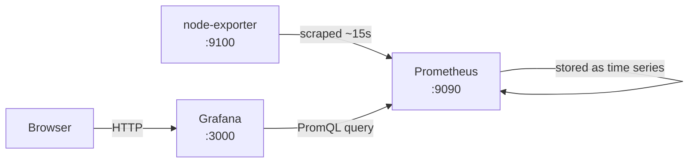

# Prometheus + Grafana + node-exporter — Pi Cheat Sheet

Sep 24, 2026 · @AlexanderKuzmiankou

## Architecture

Node-exporter, Prometheus, and Grafana form a pull-based pipeline: nothing pushes data, Prometheus reaches out and pulls it on a schedule.

When the Grafana page loads slowly or not at all, the break is almost always at the Grafana box (querying Prometheus or serving the browser) rather than upstream at Prometheus or node-exporter, since those two run far lighter and more steadily.

## Components

| Component | Role | Default port | Talks to |
| --- | --- | --- | --- |
| node-exporter | Exposes host-level metrics (CPU, memory, disk, network) at a `/metrics` endpoint | 9100 | Scraped by Prometheus |
| Prometheus | Pulls metrics from its configured targets on a schedule, stores them as time series, can evaluate alert rules | 9090 | Scrapes node-exporter; queried by Grafana |
| Grafana | Runs PromQL queries against Prometheus and renders the results as dashboards | 3000 | Queries Prometheus; serves the browser |

Ports above are the images' defaults — confirm against your `docker-compose.yml` if any were remapped.

## Operating commands

- Live resource usage across all four containers: `docker stats`
- Was a container OOM-killed, and how many times has it restarted: `docker inspect <container> --format='{{.State.OOMKilled}} restarts={{.RestartCount}}'`
- Tail recent logs: `docker logs <container> --tail 100`
- Restart just one service: `docker compose restart grafana`
- Confirm Prometheus is actually scraping its targets: open `http://<pi-ip>:9090/targets` in a browser — every target should show `UP`
- Run a quick query straight against Prometheus (bypassing Grafana, to isolate which layer is broken): `up{job="node-exporter"}` in the Prometheus UI's query box

## Known issues

- **Grafana pinned near its memory limit (found Sep 24).** It was sitting at 121MB of a 128MB cgroup limit (94.78%). At that margin, Grafana's Go runtime garbage-collects constantly to stay under the ceiling, which explains the elevated idle CPU (11.27%), and eventually Docker's OOM killer steps in — that's why the dashboard loads sometimes and not others, rather than a networking or config problem.
- **Fix in progress:** raise Grafana's memory limit to roughly 192–256MB, set `GF_LOG_LEVEL=warn` to cut log volume, and check for any dashboard panel refreshing faster than \~30s.
- **Disk I/O red flag, not yet explained.** Grafana had written 18GB of block I/O versus under 60MB combined for the other three containers. Worth checking `docker logs` for repeated OOM kills and reviewing dashboard refresh intervals before assuming the memory limit alone is the fix — that volume of writes on an SD card risks wear and corruption over time.
- **Standing constraint:** the Pi 3B+ has 1GB RAM total shared across the OS and all four containers, so a tight memory budget is a deliberate tradeoff here, not something to eliminate — tune within it rather than assuming more headroom is always the answer.
