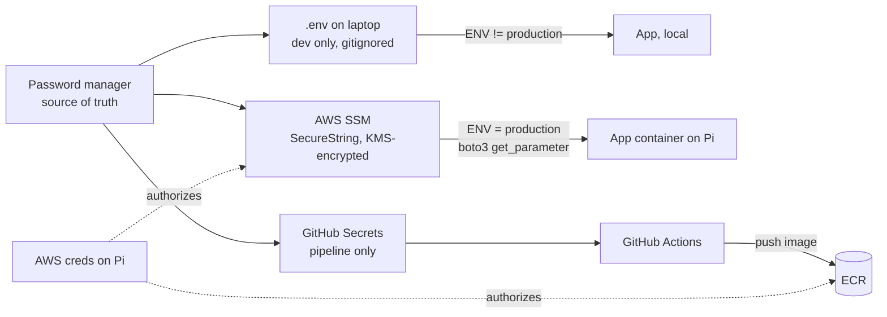

# MakeMyDays: Security Cheatsheet

Every credential the project uses, where it lives, what happens if it leaks, and what has to change before real users arrive. This file holds **no secret values**. Placeholders like `<account-id>` stand in for real ones; those live only in a password manager, SSM or GitHub Secrets.

---

## 1. What we're protecting

| Asset | Why it matters | Worst case |
|---|---|---|
| Cloud credentials (AWS) | control over infra and data | someone runs up a bill, reads/deletes DynamoDB |
| Paid API keys (Anthropic, Polly via AWS) | pay-per-use | key abuse = direct cost |
| Google OAuth tokens | read access to a real calendar and task list | private schedule exposed |
| User accounts (emails, password hashes, sessions) | other people's data | account takeover, GDPR incident |
| User content (habits, shopping, later budget) | personal data | privacy breach |
| The Pi itself | runs everything, sits in the home network | foothold into the LAN |

Mental model: **secrets are keys, not passwords you remember.** Every one should be revocable, replaceable and scoped to the smallest job it does.

---

## 2. Secrets inventory

| Secret | What it is | Dev location | Prod location | Read by | If leaked | How to rotate |
|---|---|---|---|---|---|---|
| Anthropic API key | bearer token for Claude API | `.env` | SSM `/makemyday/anthropic_api_key` | `config.py` | anyone can bill your account | Anthropic console: create new, update SSM, delete old |
| Telegram bot token | full control of the bot | `.env` | SSM `/makemyday/telegram_bot_token` | `telegram_bot.py` | attacker can message as your bot, read its updates | BotFather `/revoke`, update SSM |
| Telegram chat ID | who receives the briefing | `.env` | SSM `/makemyday/telegram_chat_id` | `telegram_bot.py` | low risk alone, dangerous paired with the token | change only if chat changes |
| `SESSION_SECRET` | HMAC key that signs session cookies | `.env` | **should be SSM** (see findings) | `auth/security.py` | attacker can forge a login as **any user** | generate new, deploy; every user is logged out |
| Google OAuth client (`credentials.json`) | client ID + client secret of your Google Cloud app | project root, gitignored | **no longer used** (Google integration removed) | — | others can impersonate your app in OAuth flows | Google Cloud console: reset secret, download new file |
| Google user token (`token.json`) | access + **refresh** token for your Google account | project root, gitignored | **no longer used** (Google integration removed) | — | read access to your calendar and tasks until revoked | Google account → Security → third-party access → remove, re-run OAuth |
| AWS access keys, Terraform/CI user | long-lived key pair, broad permissions | `~/.aws/credentials` | GitHub Secrets `AWS_ACCESS_KEY_ID` / `AWS_SECRET_ACCESS_KEY` | Terraform, `deploy.yml` | near-full control of the account | IAM: create 2nd key, swap everywhere, deactivate, delete old |
| AWS credentials on the Pi | lets the container reach SSM, DynamoDB, Polly, ECR | n/a | Pi `~/.aws` or env | boto3 in the app | whatever that identity allows | same as above; use a separate identity from CI |
| ECR login token | short-lived registry password | generated on demand | generated on demand | `docker login` | expires in 12h | nothing to rotate |
| Cloudflare Tunnel credential | lets `cloudflared` claim your hostname | n/a | on the Pi (tunnel token or credentials JSON) | `cloudflared` | attacker can route your domain to their machine | Cloudflare dashboard: delete/recreate tunnel |
| Grafana admin password | dashboard login | n/a | k3s Secret / Helm values | Grafana | view metrics, pivot via data sources | change in Grafana, update Secret |
| SSH keys (Pi, legacy EC2) | shell access | `~/.ssh` on your laptop | `authorized_keys` on the host | you | full shell on the host | new keypair, replace `authorized_keys` |
| Terraform state | may contain resource attributes incl. secrets | never local | S3 bucket, encrypted, DynamoDB lock | Terraform | infra details, possibly secret values | keep bucket private + versioned |
| User password hashes | PBKDF2 hashes in `makemydays-users` | DynamoDB | DynamoDB | `auth/service.py` | offline cracking of weak passwords | force reset (needs a reset flow) |
| Session cookies | signed `session` cookie per user | browser | browser | `get_current_user` | session hijack until expiry | rotate `SESSION_SECRET` to kill all |

Personal accounts that protect all of the above: **AWS root, GitHub, Google, Cloudflare, Anthropic, domain registrar.** All need MFA. Losing GitHub means losing access to the GitHub Secrets and the pipeline.

---

## 3. How secrets flow



The switch is in `app/config.py`: `ENV=production` reads SSM, anything else reads `.env`.

---

## 4. Golden rules

1. **Never commit a secret.** `.gitignore` covers `.env`, `credentials.json`, `token.json`, `*.tfstate`, `k8s/secret.yaml`. Deleting a commit doesn't unleak it: once pushed, **rotate it**.
2. **Never bake secrets into the image.** `.dockerignore` excludes `.env`, `credentials.json`, `token.json`. Anyone who can pull the image can read every layer.
3. **One identity per job.** CI, Terraform and the Pi should not share an AWS key.
4. **Least privilege, specific ARNs.** `ssm:GetParameter` on `arn:aws:ssm:eu-central-1:<account-id>:parameter/makemyday/*` beats `AmazonSSMReadOnlyAccess`.
5. **Prefer short-lived over long-lived.** ECR tokens (12h) and OIDC tokens (minutes) are safer than access keys that never expire.
6. **Base64 is not encryption.** Applies to k8s Secrets and the session token payload.
7. **Log events, not secrets.** Never print tokens, cookies, or full request bodies.
8. **No secret defaults in production.** If a secret is missing, the app should fail to start rather than fall back to a known value.

---

## 5. AWS identity and access

### Today

| Identity | Type | Used by | Permissions |
|---|---|---|---|
| `makemyday-terraform` | IAM user + access key | local Terraform, GitHub Actions | broad: EC2, S3, DynamoDB, ECR, IAM, SSM |
| `makemyday-ec2-role` | IAM role | EC2 (legacy) | SSM read, ECR read, Polly |
| Pi credentials | whatever is configured there | app container | check and scope down |

### Target before going live

| Identity | How it authenticates | Allowed actions |
|---|---|---|
| GitHub Actions | **OIDC role**, no stored keys | ECR push to the one repo |
| Terraform (you) | IAM user with MFA or SSO | infra management |
| App runtime (Pi / future host) | dedicated IAM user or role | SSM read on `/makemyday/*`, DynamoDB CRUD on the app tables, Polly synthesize, ECR pull |
| Root user | MFA, no access keys, never used day to day | everything |

Account-level hygiene:

- AWS Budgets alarm (e.g. at 5 €, 20 €) so key abuse shows up in hours, not at month end.
- CloudTrail on (management events are free) so you can see what a leaked key did.
- `aws iam get-credential-report` now and then: find old or unused keys.

---

## 6. Application security

| Area | Current state | Status | Notes |
|---|---|---|---|
| Password hashing | PBKDF2-SHA256, 260k iterations, 16-byte salt | OK | OWASP now suggests 600k for PBKDF2, or switch to argon2id |
| Hash / signature compare | `hmac.compare_digest` | OK | prevents timing attacks |
| Session cookie | `HttpOnly`, `SameSite=Lax`, `Secure` in prod | OK | JS can't read it, not sent on cross-site POSTs |
| Session expiry | 30 min sliding idle timeout | OK | |
| Session revocation | stateless tokens, logout only deletes the cookie | Gap | a stolen token stays valid until `exp`; needs a server-side session table or token version per user |
| Login error message | generic "Invalid email or password" | OK | |
| Signup error | "account already exists" (409) | Gap | lets anyone check if an email is registered |
| Authorization | ownership check on every habit/shopping item | OK | keep this pattern for every new feature |
| Unauthenticated data routes | `/api/events`, `/api/tasks`, `/api/briefing`, `/api/briefing/audio` | **Risk** | public on the domain; calendar/tasks come from your Google account; audio calls Polly (cost) |
| Side effects on GET | `/api/briefing` will send a Telegram message once re-enabled | Gap | GETs can be triggered by links/crawlers; use POST for actions |
| CSRF | SameSite=Lax + JSON bodies | mostly OK | add a CSRF token or `Origin` check if you ever allow cross-site use |
| CORS | not configured (same origin) | OK | keep it closed; open only to specific origins if the mobile app/web split needs it |
| Input validation | Pydantic types; email check; password ≥ 8 | partial | add max lengths on all strings, validate URLs |
| Stored URLs | shopping `url` rendered as `href` | **Risk** | a `javascript:` URL executes on click; allow only `http(s)://` |
| Avatar | data URL stored in DynamoDB | Gap | cap size (DynamoDB item limit is 400 KB), accept only `data:image/` |
| Rate limiting | none | Gap | brute force on login, cost abuse on Claude/Polly routes |
| Security headers | none set | Gap | CSP, `X-Content-Type-Options`, `Referrer-Policy`, HSTS (Cloudflare can add some) |
| `/docs`, `/openapi.json` | public | Gap | disable in prod: `FastAPI(docs_url=None, redoc_url=None, openapi_url=None)` |
| `/metrics` | public through the tunnel | Gap | block at Cloudflare or serve on a separate internal port |
| Error details | `HTTPException` messages only | OK | never return stack traces or `str(e)` from boto3 errors |

---

## 7. Host, network and containers

**Pi**

- SSH: key-only (`PasswordAuthentication no`), no root login (`PermitRootLogin no`).
- `unattended-upgrades` for security patches.
- No ports forwarded on the router. Cloudflare Tunnel is outbound-only, which is the main reason it's safer than port forwarding.
- Firewall (`ufw`): allow SSH from the LAN only; everything else stays closed since the tunnel needs no inbound ports.
- It's in your home network: if it's compromised, the LAN is reachable. A guest VLAN/network for it is a nice extra.

**Cloudflare**

- Only the app hostname goes through the tunnel. If Grafana is ever exposed, put **Cloudflare Access** (SSO/email login) in front of it.
- Rules to consider: block `/metrics`, `/docs`, `/openapi.json`; rate-limit `/api/auth/*`.
- SSL mode "Full (strict)" if there's ever a cert on the origin; with a tunnel, the tunnel itself is encrypted.

**Docker**

- The `Dockerfile` runs as **root** today. Add a non-root user:
  ```dockerfile
  RUN useradd --create-home appuser
  USER appuser
  ```
- Mount secret files read-only: `-v ./token.json:/app/token.json:ro`.
- Don't pass secrets via `--build-arg` (they end up in image history).
- Check an image for leaks: `docker history --no-trunc <image>` and `docker run --rm <image> ls -la /app`.

**k3s**

- Kubernetes Secrets are base64 in etcd. k3s supports encryption at rest: `k3s server --secrets-encryption`.
- `k8s/secret.yaml` is gitignored; keep it that way, or generate it from SSM instead of writing it by hand.

---

## 8. CI/CD and supply chain

| Item | Current | Target |
|---|---|---|
| AWS auth in pipeline | long-lived access key in GitHub Secrets | OIDC role (`aws-actions/configure-aws-credentials` with `role-to-assume`) |
| Tests before build | running, but auth tests currently skipped | re-enable before login goes live |
| Action versions | tags like `@v4` | pin to commit SHA for third-party actions |
| Dependency updates | manual | Dependabot for pip, npm, GitHub Actions |
| Vulnerability scan | none | `pip-audit`, `npm audit`, ECR "scan on push" |
| Secret scanning | none | GitHub secret scanning + push protection (free on public repos), `gitleaks` locally |
| Branch protection | direct pushes to `main` deploy | require the test job to pass; no force pushes |
| Workflow permissions | default | `permissions: contents: read` at the top, add `id-token: write` for OIDC |

A public repo means **anyone can read the workflow file**. That's fine as long as secrets only come from `${{ secrets.* }}` and pull requests from forks can't reach them (the default).

---

## 9. Going live with many users

### Identity and sessions

- [ ] Email verification on signup
- [ ] Password reset via emailed one-time token (short expiry, single use, hashed at rest)
- [ ] Rate limit and lockout/backoff on login, signup, reset
- [ ] Server-side session revocation (logout everywhere, invalidate on password change)
- [ ] Stronger hashing: argon2id, or PBKDF2 at 600k+ with rehash-on-login
- [ ] Optional MFA (TOTP)
- [ ] Consider a managed provider (Cognito, Auth0, Clerk) vs. keeping it hand-rolled: managed = fewer footguns, hand-rolled = more learning

### Google integration per user

Today there is **one** `token.json`, which means one Google account for the whole app. For multiple users:

- [ ] Switch from `InstalledAppFlow` (desktop flow) to the **web server OAuth flow** with a redirect URI on your domain
- [ ] Use a random `state` parameter to prevent OAuth CSRF
- [ ] Store each user's refresh token in DynamoDB, **encrypted** (KMS or envelope encryption), never in files
- [ ] Request the minimum scopes (`calendar.readonly`, `tasks.readonly`)
- [ ] Calendar scopes are "sensitive": Google requires app verification beyond the testing user cap, including a privacy policy URL
- [ ] Let users disconnect Google and delete the stored token

### Data

- [ ] Every query scoped by `user_id` (move from `scan` to a GSI + `query`, which also stops reading other users' rows at all)
- [ ] DynamoDB point-in-time recovery (backups)
- [ ] Encryption at rest is on by default; decide whether to use a customer-managed KMS key
- [ ] Budget / shared costs data is financial: treat it as the most sensitive table

### Abuse and cost control

- [ ] Per-user quotas on Claude and Polly calls
- [ ] Spend limits in the Anthropic console
- [ ] Cloudflare bot protection / Turnstile on signup

### Privacy (you're in Germany, so GDPR applies)

- [ ] Impressum and Datenschutzerklärung on the site
- [ ] State clearly that calendar data is sent to Anthropic to generate briefings
- [ ] Data processing agreements with AWS, Anthropic, Cloudflare (all offer standard DPAs)
- [ ] Prefer EU regions (already `eu-central-1`)
- [ ] User self-service: export my data, delete my account (including Google tokens)
- [ ] Only collect what features need; define retention

### Monitoring and response

- [ ] Alerts on failed-login spikes, 5xx spikes, unusual AWS spend
- [ ] Structured logs without secrets or passwords
- [ ] A written incident playbook (section 11)

### Mobile app later

- Cookies don't fit native apps well: use short-lived access token + refresh token, stored in iOS Keychain / Android Keystore
- **Never ship an API key inside the app.** Anything in an app binary can be extracted. The app talks only to your backend; the backend holds Anthropic/AWS/Google secrets
- Consider certificate pinning and App Attest / Play Integrity once there's real traffic

---

## 10. Commands

```bash
# Generate a strong secret (SESSION_SECRET, tokens)
python -c "import secrets; print(secrets.token_urlsafe(48))"

# Write a secret to SSM without putting it in shell history
read -rs SECRET && aws ssm put-parameter \
  --name /makemyday/<name> --type SecureString \
  --value "$SECRET" --overwrite && unset SECRET

# Read it back (check it exists, don't print it in shared terminals)
aws ssm get-parameter --name /makemyday/<name> --with-decryption \
  --query Parameter.Version

# List SSM parameters for the app
aws ssm get-parameters-by-path --path /makemyday --query "Parameters[].Name"

# Rotate an IAM access key
aws iam list-access-keys --user-name <user>
aws iam create-access-key --user-name <user>          # update GitHub Secrets / ~/.aws
aws iam update-access-key --user-name <user> --access-key-id <old> --status Inactive
aws iam delete-access-key --user-name <user> --access-key-id <old>

# Who am I right now? (catches "wrong credentials" surprises)
aws sts get-caller-identity

# Scan the repo and its whole history for leaked secrets
gitleaks detect --source . -v

# Is anything sensitive tracked by git?
git ls-files | grep -Ei '\.env$|credentials|token\.json|tfstate|secret'

# Does the image contain files it shouldn't?
docker run --rm <image> sh -c 'ls -la /app; test -f /app/.env && echo "LEAK: .env"'
```

---

## 11. Incident playbook: "I leaked a secret"

1. **Revoke first, investigate second.** Deactivate the key / revoke the token right away (sections 2 and 10).
2. **Issue a replacement** and update SSM / GitHub Secrets / `.env`.
3. **Restart what uses it** so nothing holds the old value in memory.
4. **Check the damage:** CloudTrail for AWS keys, Anthropic usage page, Telegram bot activity, Google account security page.
5. **Clean up history** if it was committed (`git filter-repo`), but treat the secret as burned anyway: public GitHub repos get scraped within minutes.
6. **Write it down** in the DEVLOG: what leaked, how, what changed so it can't happen the same way again.

For `SESSION_SECRET` specifically: rotating it logs out everyone, which is exactly what you want after a leak.

---

## 12. Current findings (update as they get fixed)

- [ ] `/api/events` and `/api/tasks` are unauthenticated and return data from your personal Google account
- [ ] `/api/briefing/audio` is unauthenticated and calls Polly (cost abuse)
- [ ] `SESSION_SECRET` falls back to a hardcoded dev value and isn't loaded from SSM
- [ ] Shopping `url` isn't restricted to `http(s)://` (`javascript:` links)
- [ ] `/metrics`, `/docs`, `/openapi.json` public through the tunnel
- [ ] No rate limiting anywhere
- [ ] Container runs as root
- [ ] CI uses a long-lived, broadly scoped AWS key (move to OIDC, narrow scope)
- [ ] Pi AWS identity: confirm it's separate from CI and least privilege
- [ ] Auth tests skipped while login is disabled; re-enable together
- [ ] Legacy EC2 security group allows SSH from `0.0.0.0/0` (irrelevant while destroyed, fix before any `terraform apply`)
- [x] Git history scanned: no committed keys, tokens or credential files found

---

*Last reviewed: 2026-09-25*
